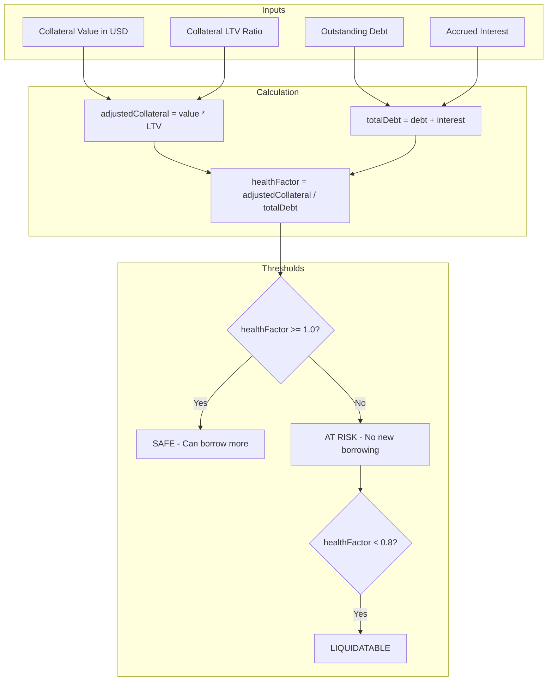

# Credit & Drawdown Protection - Call Graph

## Module 9: CreditLineVault Flow

```mermaid
flowchart TD
    subgraph "Collateral Management"
        C1[depositCollateral]
        C2[validateCollateralType]
        C3[updateCollateralBalance]
        C4[recalculateHealthFactor]
    end

    subgraph "Borrowing"
        B1[borrow]
        B2[checkCreditLimit]
        B3[checkHealthFactor]
        B4[mintAXUSD]
        B5[updateDebt]
    end

    subgraph "Repayment"
        R1[repay]
        R2[burnAXUSD]
        R3[calculateInterest]
        R4[reduceDebt]
    end

    subgraph "Liquidation"
        L1[liquidate]
        L2[checkUndercollateralized]
        L3[calculateLiquidationAmount]
        L4[transferCollateral]
        L5[reduceDebt]
        L6[payLiquidator]
    end

    C1 --> C2
    C2 --> C3
    C3 --> C4
    
    B1 --> B2
    B2 --> B3
    B3 --> B4
    B4 --> B5
    
    R1 --> R3
    R3 --> R2
    R2 --> R4
    
    L1 --> L2
    L2 --> L3
    L3 --> L4
    L4 --> L5
    L5 --> L6
```

## Health Factor Calculation

```mermaid
flowchart TD
    subgraph "Inputs"
        I1[Collateral Value in USD]
        I2[Collateral LTV Ratio]
        I3[Outstanding Debt]
        I4[Accrued Interest]
    end

    subgraph "Calculation"
        CA1[adjustedCollateral = value * LTV]
        CA2[totalDebt = debt + interest]
        CA3[healthFactor = adjustedCollateral / totalDebt]
    end

    subgraph "Thresholds"
        T1{healthFactor >= 1.0?}
        T2[SAFE - Can borrow more]
        T3[AT RISK - No new borrowing]
        T4{healthFactor < 0.8?}
        T5[LIQUIDATABLE]
    end

    I1 --> CA1
    I2 --> CA1
    I3 --> CA2
    I4 --> CA2
    
    CA1 --> CA3
    CA2 --> CA3
    
    CA3 --> T1
    T1 -->|Yes| T2
    T1 -->|No| T3
    T3 --> T4
    T4 -->|Yes| T5
```
