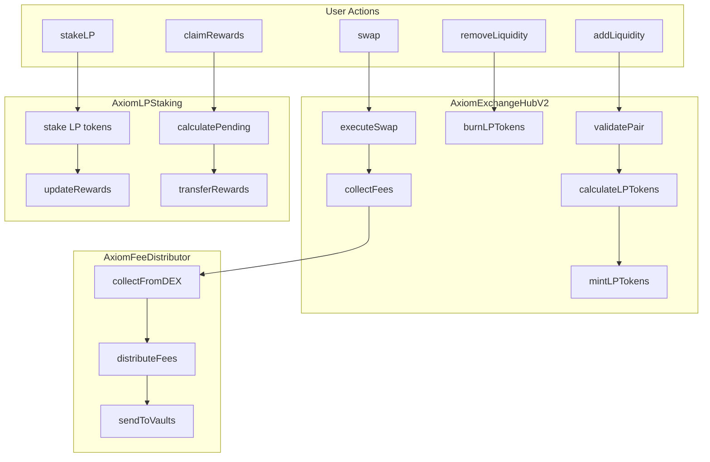
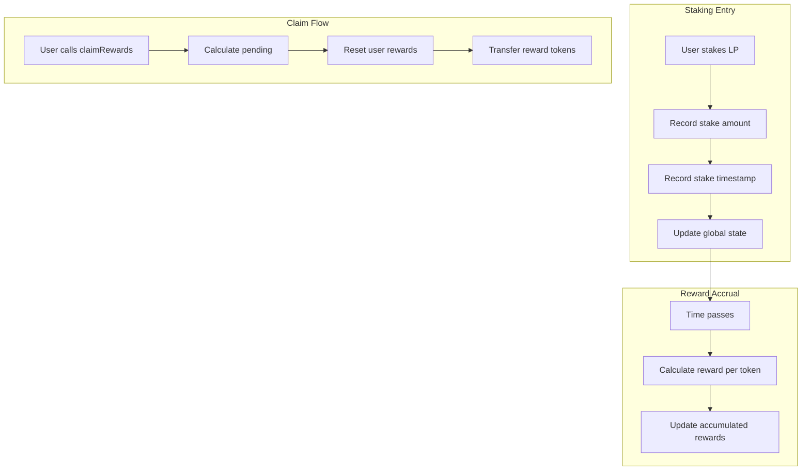

# Liquidity Deployment Module - Call Graph

## Module 7: DEX Liquidity Flow

```mermaid
flowchart TD
    subgraph "User Actions"
        U1[addLiquidity]
        U2[removeLiquidity]
        U3[swap]
        U4[stakeLP]
        U5[claimRewards]
    end

    subgraph "AxiomExchangeHubV2"
        D1[validatePair]
        D2[calculateLPTokens]
        D3[mintLPTokens]
        D4[burnLPTokens]
        D5[executeSwap]
        D6[collectFees]
    end

    subgraph "AxiomLPStaking"
        S1[stake LP tokens]
        S2[updateRewards]
        S3[calculatePending]
        S4[transferRewards]
    end

    subgraph "AxiomFeeDistributor"
        F1[collectFromDEX]
        F2[distributeFees]
        F3[sendToVaults]
    end

    U1 --> D1
    D1 --> D2
    D2 --> D3
    
    U2 --> D4
    
    U3 --> D5
    D5 --> D6
    D6 --> F1
    
    U4 --> S1
    S1 --> S2
    
    U5 --> S3
    S3 --> S4
    
    F1 --> F2
    F2 --> F3
```

## LP Staking Reward Calculation

```mermaid
flowchart TD
    subgraph "Staking Entry"
        A1[User stakes LP]
        A2[Record stake amount]
        A3[Record stake timestamp]
        A4[Update global state]
    end

    subgraph "Reward Accrual"
        B1[Time passes]
        B2[Calculate reward per token]
        B3[Update accumulated rewards]
    end

    subgraph "Claim Flow"
        C1[User calls claimRewards]
        C2[Calculate pending]
        C3[Reset user rewards]
        C4[Transfer reward tokens]
    end

    A1 --> A2
    A2 --> A3
    A3 --> A4
    
    A4 --> B1
    B1 --> B2
    B2 --> B3
    
    C1 --> C2
    C2 --> C3
    C3 --> C4
```
