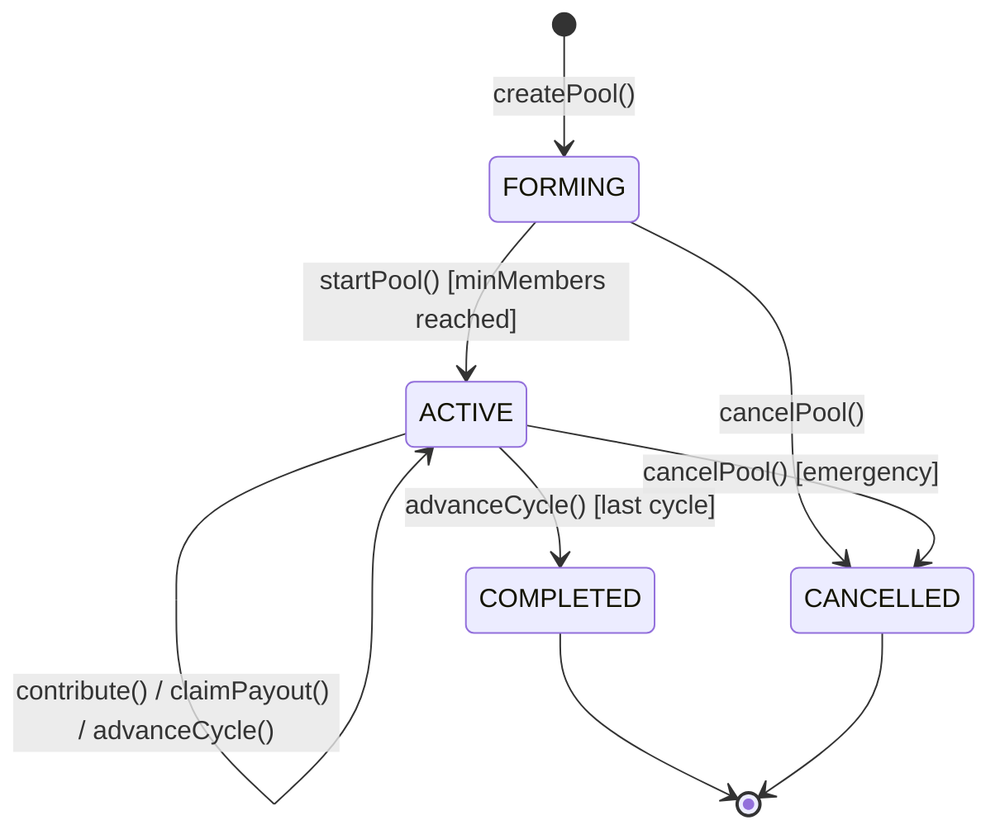
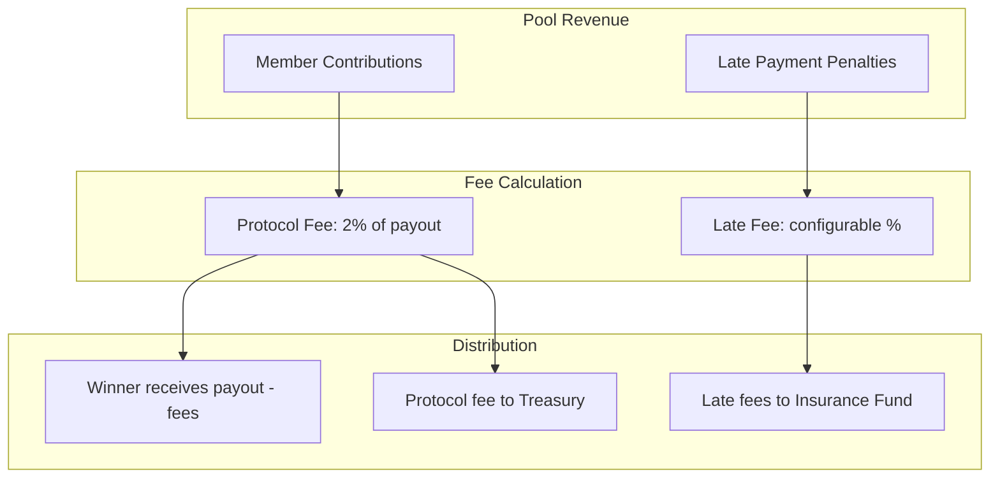

# SUSU Lifecycle - Call Graph

## Module 12: SUSU Pool Lifecycle

```mermaid
stateDiagram-v2
    [*] --> FORMING: createPool()
    FORMING --> ACTIVE: startPool() [minMembers reached]
    FORMING --> CANCELLED: cancelPool()
    ACTIVE --> ACTIVE: contribute() / claimPayout() / advanceCycle()
    ACTIVE --> COMPLETED: advanceCycle() [last cycle]
    ACTIVE --> CANCELLED: cancelPool() [emergency]
    COMPLETED --> [*]
    CANCELLED --> [*]
```

## SUSU Contribution Flow

```mermaid
flowchart TD
    subgraph "Pool Creation"
        P1[createPool]
        P2[Set contribution amount]
        P3[Set cycle duration]
        P4[Set max members]
        P5[Emit PoolCreated]
    end

    subgraph "Member Join"
        J1[joinPool]
        J2[Verify pool open]
        J3[Check not already member]
        J4[Add to member list]
        J5[Emit MemberJoined]
    end

    subgraph "Contribution Cycle"
        C1[contribute]
        C2[Verify active pool]
        C3[Verify correct cycle]
        C4[Transfer tokens]
        C5[Mark as contributed]
        C6[Check all contributed]
    end

    subgraph "Payout"
        PO1[claimPayout]
        PO2[Verify winner]
        PO3[Calculate payout]
        PO4[Deduct protocol fee]
        PO5[Transfer to winner]
        PO6[Emit PayoutClaimed]
    end

    subgraph "Cycle Advance"
        A1[advanceCycle]
        A2[Determine next winner]
        A3[Reset contribution flags]
        A4[Increment cycle]
        A5{Last cycle?}
        A6[Mark COMPLETED]
        A7[Continue ACTIVE]
    end

    P1 --> P2 --> P3 --> P4 --> P5
    J1 --> J2 --> J3 --> J4 --> J5
    C1 --> C2 --> C3 --> C4 --> C5 --> C6
    PO1 --> PO2 --> PO3 --> PO4 --> PO5 --> PO6
    A1 --> A2 --> A3 --> A4 --> A5
    A5 -->|Yes| A6
    A5 -->|No| A7
```

## SUSU Fee Flow

```mermaid
flowchart TD
    subgraph "Pool Revenue"
        R1[Member Contributions]
        R2[Late Payment Penalties]
    end

    subgraph "Fee Calculation"
        F1[Protocol Fee: 2% of payout]
        F2[Late Fee: configurable %]
    end

    subgraph "Distribution"
        D1[Winner receives payout - fees]
        D2[Protocol fee to Treasury]
        D3[Late fees to Insurance Fund]
    end

    R1 --> F1
    R2 --> F2
    
    F1 --> D1
    F1 --> D2
    F2 --> D3
```
