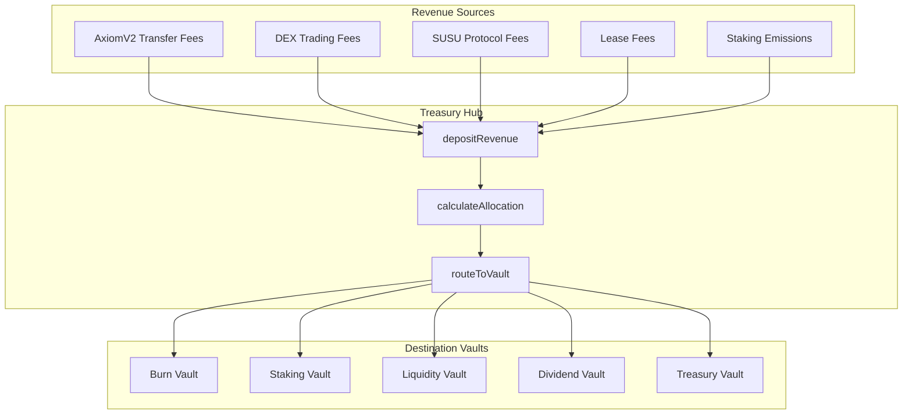
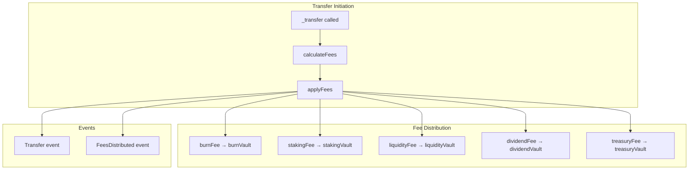

# Treasury Core - Call Graph

## Module 1: Treasury Core Flow

```mermaid
flowchart TD
    subgraph "Revenue Sources"
        A1[AxiomV2 Transfer Fees]
        A2[DEX Trading Fees]
        A3[SUSU Protocol Fees]
        A4[Lease Fees]
        A5[Staking Emissions]
    end

    subgraph "Treasury Hub"
        B1[depositRevenue]
        B2[routeToVault]
        B3[calculateAllocation]
    end

    subgraph "Destination Vaults"
        C1[Burn Vault]
        C2[Staking Vault]
        C3[Liquidity Vault]
        C4[Dividend Vault]
        C5[Treasury Vault]
    end

    A1 --> B1
    A2 --> B1
    A3 --> B1
    A4 --> B1
    A5 --> B1
    
    B1 --> B3
    B3 --> B2
    
    B2 --> C1
    B2 --> C2
    B2 --> C3
    B2 --> C4
    B2 --> C5
```

## AxiomV2 Transfer Fee Flow

```mermaid
flowchart TD
    subgraph "Transfer Initiation"
        T1[_transfer called]
        T2[calculateFees]
        T3[applyFees]
    end

    subgraph "Fee Distribution"
        F1[burnFee → burnVault]
        F2[stakingFee → stakingVault]
        F3[liquidityFee → liquidityVault]
        F4[dividendFee → dividendVault]
        F5[treasuryFee → treasuryVault]
    end

    subgraph "Events"
        E1[Transfer event]
        E2[FeesDistributed event]
    end

    T1 --> T2
    T2 --> T3
    
    T3 --> F1
    T3 --> F2
    T3 --> F3
    T3 --> F4
    T3 --> F5
    
    T3 --> E1
    T3 --> E2
```
